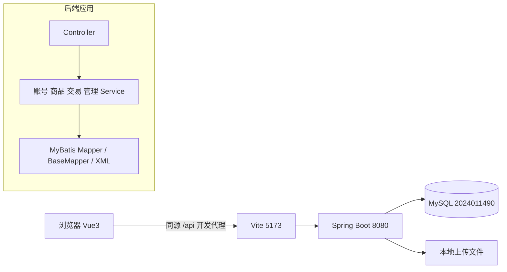
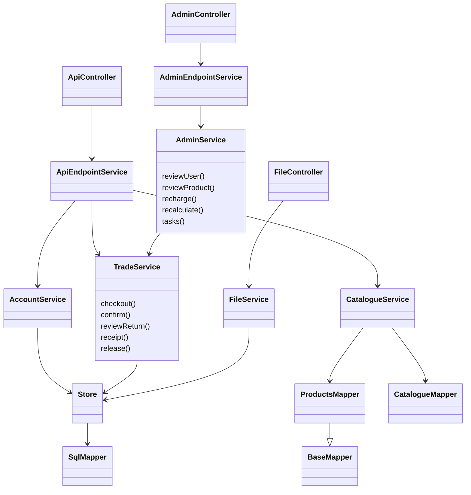
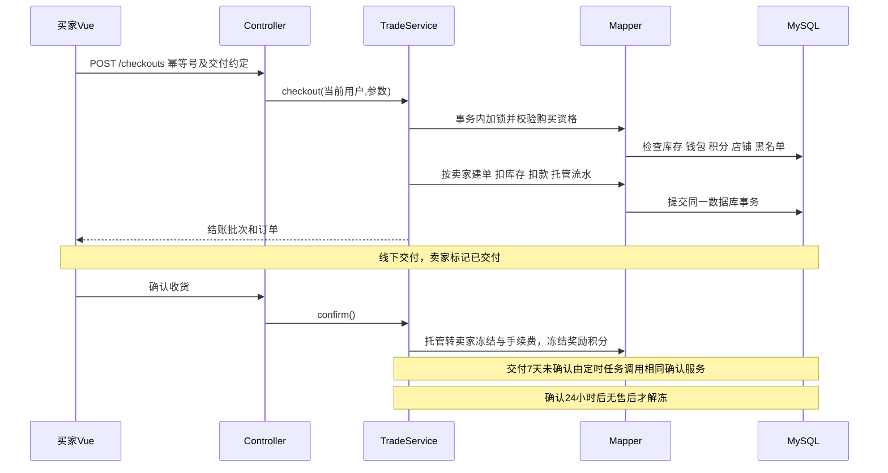
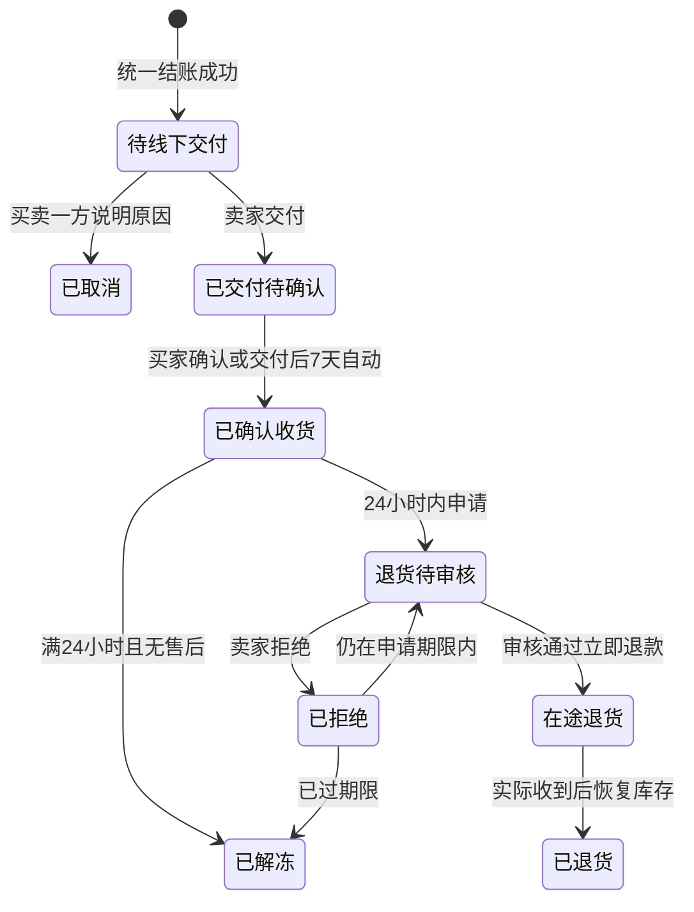

# 系统图示

以下图示依据当前代码说明结构与核心交易，可作为学习和用户自行绘制报告图的参考，不代写报告正文。

## 部署与模块

```mermaid
flowchart LR
  B[浏览器 Vue3] -->|同源 /api 开发代理| V[Vite 5173]
  V --> S[Spring Boot 8080]
  S --> D[(MySQL 2024011490)]
  S --> F[本地上传文件]
  subgraph 后端应用
    C[Controller] --> A[账号 商品 交易 管理 Service]
    A --> M[MyBatis Mapper / BaseMapper / XML]
  end
```

## 核心类关系

```mermaid
classDiagram
  ApiController --> ApiEndpointService
  AdminController --> AdminEndpointService
  FileController --> FileService
  ApiEndpointService --> AccountService
  ApiEndpointService --> CatalogueService
  ApiEndpointService --> TradeService
  AdminEndpointService --> AdminService
  AdminService --> TradeService
  AccountService --> Store
  CatalogueService --> ProductsMapper
  CatalogueService --> CatalogueMapper
  TradeService --> Store
  FileService --> Store
  Store --> SqlMapper
  ProductsMapper --|> BaseMapper
  class TradeService {
    checkout()
    confirm()
    reviewReturn()
    receipt()
    release()
  }
  class AdminService {
    reviewUser()
    reviewProduct()
    recharge()
    recalculate()
    tasks()
  }
```

## 下单到结算时序

```mermaid
sequenceDiagram
  participant B as 买家Vue
  participant C as Controller
  participant S as TradeService
  participant M as Mapper
  participant D as MySQL
  B->>C: POST /checkouts 幂等号及交付约定
  C->>S: checkout(当前用户,参数)
  S->>M: 事务内加锁并校验购买资格
  M->>D: 检查库存 钱包 积分 店铺 黑名单
  S->>M: 按卖家建单 扣库存 扣款 托管流水
  M->>D: 提交同一数据库事务
  S-->>B: 结账批次和订单
  Note over B,D: 线下交付，卖家标记已交付
  B->>C: 确认收货
  C->>S: confirm()
  S->>M: 托管转卖家冻结与手续费，冻结奖励积分
  Note over S,D: 交付7天未确认由定时任务调用相同确认服务
  Note over S,D: 确认24小时后无售后才解冻
```

## 订单及退货状态

```mermaid
stateDiagram-v2
  [*] --> 待线下交付: 统一结账成功
  待线下交付 --> 已取消: 买卖一方说明原因
  待线下交付 --> 已交付待确认: 卖家交付
  已交付待确认 --> 已确认收货: 买家确认或交付后7天自动
  已确认收货 --> 已解冻: 满24小时且无售后
  已确认收货 --> 退货待审核: 24小时内申请
  退货待审核 --> 已拒绝: 卖家拒绝
  已拒绝 --> 退货待审核: 仍在申请期限内
  已拒绝 --> 已解冻: 已过期限
  退货待审核 --> 在途退货: 审核通过立即退款
  在途退货 --> 已退货: 实际收到后恢复库存
```

数据库ER关系见《数据库设计》，完整字段以`database/schema.sql`为准。
